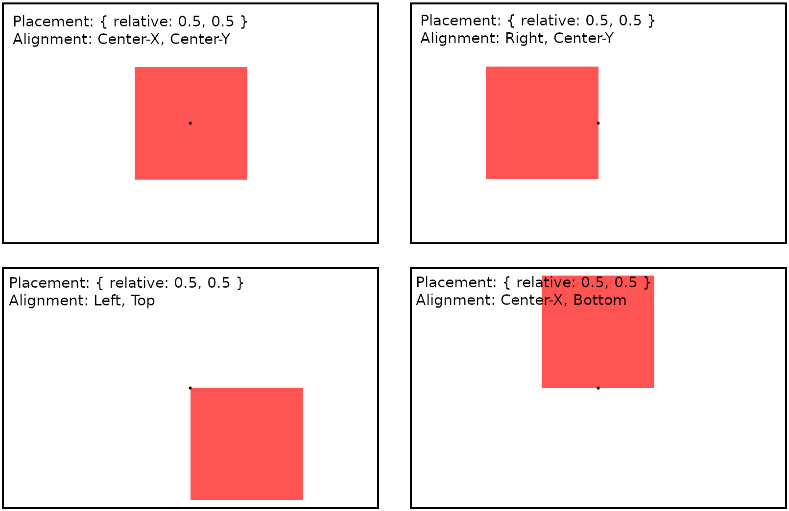

# UI

Ashbloom provides its own suite of tools that render UI passes with Vulkan. These tools are found in the following zig components:

- `ui.core` - Where all of the basic UI components are defined.
- `ui.layouts` - Contains some additional behavior protocols for placing new UI elements.
- `ui.theme_basic` - Contains the actual immediate-mode UI components.

There is also `ui.font` which aids in font loading, but that isn't strictly related to the UI system.

You may be confused. How do `vkui.zig` and `basic.zig` both seem to contain the basic UI components? The answer is that these tools are essentially provided in two parts.

The first part, just `vkui.zig`, contain all of the foundational structures and behavior that most UI systems require. It defines the basic UI **element**, as well as a UI **container**, establishes behaviors for handling events (known as **callbacks**), etc. But, the `vkui.zig` module does not specify templates like buttons, sliders, text, textfields, etc, nor does it define any layouts. This is so that prospective developers can use this module and define their own element templates (a collection of these are known internally as a UI **theme**) to use for those basic objects.

The second part are those templates. These are provided as the "immediate-mode" theme found in `basic.zig`, as well as the layout behaviors found in `layouts.zig`. Before we describe those, however, it's good to understand what exactly an **element** is, and how this library is structured as a whole.

## Elements

Elements are the foundational unit of rendering for Ashbloom's UI system. They are front-facing quads, axis-aligned to the render image. Elements are rendered to the screen as part of an instanced draw call - the quad vertices are assumed to be baked into the shader, and the vertex array passed to the shader by the UI `Container` object is assumed to be for drawing instances rather than vertices.

The shader itself is provided by the selected theme. The `theme_basic` module references its own pair of precompiled shaders, which can be found, both compiled and uncompiled, in the same directory as the Zig file.

Elements also serve as containers for other elements. An element's contained elements are referred to as its *children*, and it is those elements' *parent*. When elements are added to other elements, they are **copied**, meaning a change to the referenced element will not affect other copies of the element added previously.

While the way elements render is ultimately up to the shader provider, elements have built-in **draw modes** which should be implemented. These draw modes include, as of 0.2.0:

- **None**: This element is skipped in the drawing/building procedures, and serves merely as a container for other elements.
- **Color**: This element is drawn with a single color.
- **Texture**: This element is drawn as a sprite or texture.
- **Character**: This element is drawn as a monochrome rendering of an image, usually used for text characters.
- **ColoredTexture**: This element multiplies a given texture with a given color.

Elements also have **placements**, which determine their positions and sizes on the screen. Placements have *relative* and *absolute* values. *Relative* values specify where the element should be relative to its parent element, while *absolute* values shift the element's position and size on a per-pixel basis. Placements also have alignment values, which are used for positioning. You can think of alignments as determining which *part* of the element is placed at the location specified with those position values. Here is a simple diagram demonstrating this:

Alignments do not affect element scale.

Besides placements, elements also specify *spaces*, which determine how much space (size) an element actually takes up. When the `space` field of an element is set to be larger than its placement would specify, the element becomes scrollable.

Elements also support **callbacks**, functions that are called when certain user input or container events occur (more on containers below). These user input events include mouse inputs and scrolling, or even pressing keys. Container events include the element getting copied or deleted. The latter is used in the case of element **layouts**, provided in `ui.layouts`, which are essentially callbacks that automatically set element placements when new elements are added to or removed from a parent.

These are the basic, self-contained properties of an element. There are more fields to explain in the next section.

## Containers

Containers are the root of Ashbloom's UI system, storing an entry point (root) for a UI element tree. They are also responsible for taking the tree and building and drawing the vertex buffers for the UI itself. The root is an element called `origin` whose boundaries (normally determined by an element's placement) have to be set manually. In most cases, those boundaries will cover the entire render image or window.

When certain properties of an element change or update, such as color or position, elements can be *refreshed* without affecting the tree, which essentially just rebuilds a small subset of the vertex buffer. However, whenever elements are added to or removed from the Container system, no matter at which final location, the entire tree must be rebuilt.

Elements have "lineage" values determining their position in the Container tree, and building or rebuilding the Container tree is what initializes and sets these values. You use these values to access and modify elements which have been added/copied to the Container directly, and there are plenty of examples of this happening in the element templates implemented in `theme_basic`.

Containers require a `ContainerRendering` struct to draw the UI. This structure consists of the typical structures you find in an Ashbloom/Vulkan draw loop: a `RenderPass` (`VkRenderPass`), `PipelineDescriptorSet` (`VkDescriptorSet`), `Pipeline` (`VkPipeline`), render queue (`VkQueue`), and a callback for updating uniform values. The basic theme, explained below, provides an example construction of this.

## The Basic Theme

The basic theme, found in `ui.layouts` and especially `ui.theme_basic`, can be thought of as an officially supported example theme that Ashbloom implements, or as an "immediate-mode" for the UI system. Found within `theme_basic` are implementations of various element templates, which include common UI components like text, buttons, sliders, and text fields. This module also implements an example `ContainerRendering`, which references precompiled shaders found within the same location as the source module.

It must be stressed that these templates work purely within the confines of the element structure; they don't make allocations outside of the element's `data` field, they don't reference global variables outside the scope of the element, etc. They are entirely self-contained. Their behaviors are mostly the result of their callbacks (responses to user input and changes to the container). Feel free to base your own UI theme's templates off of these, if you feel the need to implement your own to begin with.

The following element templates are implemented, as of 0.2.0:

- Quad (basically wraps a single color element)
- Icon (basically wraps a texture element)
- TextCharacter (basically wraps a font character element)
- Text
- Button
- Checkbox
- Slider
- Scrollbar
- Textfield

These elements are created with the various `create_` functions found in `theme_basic`. These functions allocate a new element which must be freed with the allocator passed into said function. There is a shortcut to this, which are the **`add_and_dispose`** functions found in the `Element` and `Container` structures, which add a copy of the element, and then delete the original.

Since the theme requires a certain vertex layout, certain shaders, and certain descriptors, most of the rendering questions that typical Vulkan UI drawing procedures would need to answer are already answered, and this leads to the **`init_render_instance`** function, which initializes a Vulkan graphics pipeline programmed for the `theme_basic` rendering paradigm and packages it alongside the remaining fields (most of which must be provided by you, like the render pass and queue) into a complete `ContainerRendering` struct.

### Loading a UI scene with XML

The basic theme also contains functionality to load in those UI templates from XML. The **`load_xml_ui`** file reads an .xml file and adds all elements specified to some parent element (which can be the container's `origin` element). The `xml_to_ui` test contains an example that uses this in action.

The XML loader supports all `theme_basic` element templates, as well as all layouts. Certain attributes, however, need to be specified on the Ashbloom side, such as fonts and callbacks for elements. This is the purpose of the `assets` argument in **`load_xml_ui`**. The argument should contain lists of string-key-value pairs assigning said strings to certain pointers to fonts or callback functions.

## Modules

1. [core](./pages/ui/core.md)
2. [theme_basic](./pages/ui/theme_basic.md)
3. [layouts](./pages/ui/layouts.md)
4. [font](./pages/ui/font.md)